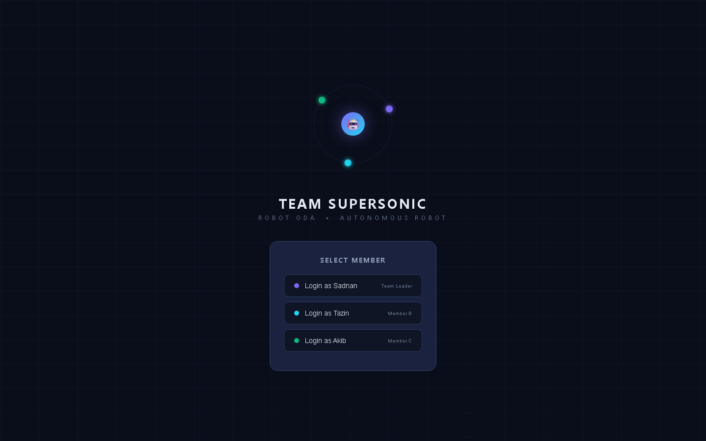

# 🤖 ultron_devboard

A real-time team command center for **Team Supersonic**'s autonomous robot
project — single-file web app, zero build step, live sync via Firebase.



**Live:** https://sajid510.github.io/ultron_devboard/

---

## ✨ What it does

The dashboard is the single source of truth for the team's day-to-day work on
the robot build — tasks, handoffs, errors, notes, and direction — synced live
across all three members.

| Feature | Description |
|---|---|
| 🔐 **Member access** | 4-digit PIN login per member (sadnan · tazin · akib); leader PIN unlocks the control page |
| 📊 **My Dashboard** | Your upcoming/done tasks, status bar, session strip, and per-member progress |
| 🔁 **Team Update** | Live overview of all members, their tasks, and progress charts |
| 🐛 **Post an Error!** | Error feed with resolution flags, comments, and per-member assignment |
| 🧭 **Leader Control** | Team direction, member direction, leader-assigned tasks, handoff manager, data reset/seed tools |
| 📝 **Notes** | My Notes + Team Notes with file attachments (base64) and viewers |
| 🤖 **T2 AI Assistant** | Team chat assistant powered by Groq (llama-3.3), per-member shared key |
| 🧠 **T2 self-learning** | T2 learns from 👍/👎 ratings on its answers, completed-task topics, and error patterns — stored in Firebase and injected into future prompts for more customized help |
| 🗂 **Data** | Firebase Realtime Database + localStorage cache — offline-friendly, live-synced |

---

## 🚀 Run it

### Option A — GitHub Pages (live)

The app is already deployed. Any push to `main` redeploys automatically.

### Option B — Local file

```bash
git clone https://github.com/sajid510/ultron_devboard.git
cd ultron_devboard
start index.html
```

> **Firebase note:** reading/writing the shared database requires Firebase
> anonymous auth. If the app is opened locally and the browser blocks the
> request, open it via the live URL or a local static server
> (`npx serve` / `python -m http.server 8080`).

---

## 🔒 Security

- **Firebase authentication** — the app signs in with Firebase anonymous auth
  before touching data.
- **Locked database rules** (`database.rules.json`):

  ```json
  { "rules": { ".read": "auth != null", ".write": "auth != null" } }
  ```

  No unauthenticated reads or writes are possible — direct access returns
  `401 Unauthorized`.
- **Member PINs** are stored in the database and checked client-side; the
  leader PIN grants access to the Leader Control page.
- **T2 API keys** use the Groq `gsk_` format, are stored per-member in the
  database and `localStorage`, and are never embedded in source.

> ⚠️ The Firebase project (`robot-oda-dashboard`) config is public by design for
> a static-site app; security comes from the database rules + auth, not from
> hiding the config.

---

## 🏗 Architecture


- **Single file** — all HTML/CSS/JS lives in `index.html` (no build step).
- **Data layer** — Firebase Realtime Database paths per domain
  (`tasks`, `handoffs`, `errors`, `notes`, `notesFiles`, `members`, `t2`).
- **Sync model** — `dbOn(path, cb)` subscribes to live updates; local caches
  (`myTasksCache`, `teamTasksCache`, `issuesCache`, …) render instantly.
- **Auth gate** — anonymous Firebase auth + rule-locked RTDB.
- **T2 assistant** — Groq chat-completions REST call with the shared key.

See [docs/ARCHITECTURE.md](docs/ARCHITECTURE.md) for the full design.

---

## 🗂 Repository structure

```
ultron_devboard/
├── index.html            # the entire app (4,100+ lines)
├── database.rules.json   # Firebase RTDB security rules
├── assets/
│   ├── architecture.svg          # system diagram
│   └── dashboard-screenshot.png  # live app screenshot
├── docs/
│   └── ARCHITECTURE.md   # design document (+ Mermaid diagram)
└── README.md
```

---

## 🧭 Team

| Member | Role |
|---|---|
| **sadnan** | Team lead (Leader Control access) |
| **tazin** | Member B |
| **akib** | Member C |

---

## 📜 License

MIT — see [`LICENSE`](LICENSE).
