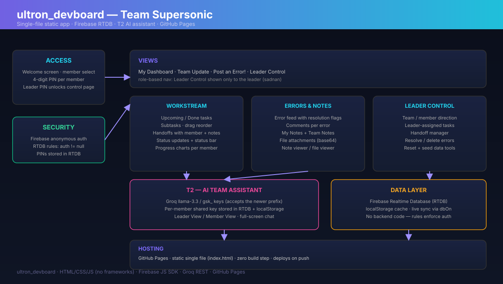
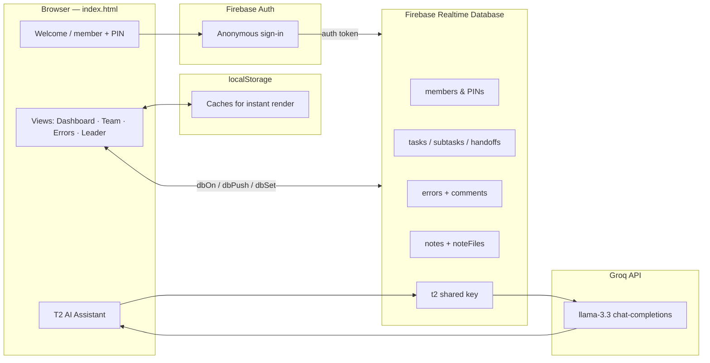
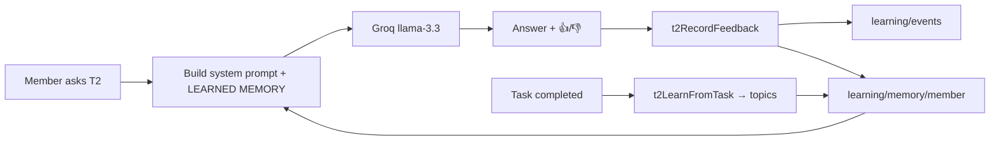

# robot_oda Dashboard — Architecture

> Design document for the Team Supersonic team command center.

## Overview

The dashboard is a **zero-build static web app**: one `index.html` contains the
entire UI and logic, backed by **Firebase Realtime Database** for live sync and
**GitHub Pages** for hosting. There is no backend to deploy.

## Data flow

## Layers

### 1. Access & security

- Welcome screen lists the three members; each selects themselves and enters a
  4-digit PIN.
- The leader PIN (sadnan) additionally unlocks **Leader Control**.
- Before any database call the app performs Firebase **anonymous auth**.
- RTDB rules (`database.rules.json`) require `auth != null` for both reads and
  writes, so unauthenticated requests are rejected by the server.

### 2. Data layer (`db*` helpers)

| Helper | Behaviour |
|---|---|
| `dbSet(path, value)` | Write a value to RTDB |
| `dbPush(path, value)` | Append to a list node |
| `dbUpdate(path, value)` | Patch a node |
| `dbRemove(path)` | Delete a node |
| `dbOn(path, cb)` | Subscribe to live changes |
| `dbOnce(path, cb)` | One-shot read |
| `dbGetLocal(path)` | Read from the local cache first |

### 3. Domains

- **Members** — identity, PINs, roles (`sadnan`/`tazin`/`akib`).
- **Tasks** — upcoming/done, subtasks, ordering, `member` attribution.
- **Handoffs** — member-to-member transfer with notes.
- **Errors** — issue feed with `resolved` flags and threaded comments.
- **Notes / noteFiles** — my/team scoped notes with base64 file attachments.
- **T2** — shared Groq API key per member for the AI assistant.

### 4. T2 AI assistant

- Chat UI with Leader / Member views and optional fullscreen mode.
- Talks to Groq's `https://api.groq.com/openai/v1/chat/completions` REST
  endpoint with `Bearer gsk_…`.
- The key resolver accepts **both** older and newer Groq key prefixes
  (`sk-ant…` / `gsk_…`), validates against the API, and stores the resolved key
  in RTDB + `localStorage`.

### 5. T2 self-learning memory

T2 becomes more helpful the more the team uses it — entirely on the free
Firebase RTDB tier:

- **Feedback** — every AI answer has 👍/👎 buttons. Ratings are written to
  `learning/events` and aggregated into `learning/memory/<member>`.
- **Few-shot learning** — the 8 most recent rated answers are stored per
  member; the 2 *liked* answers become style examples.
- **Behaviour logging** — task completions learn topic keywords
  (`t2LearnFromTask`) and posted errors are logged as events.
- **Personalization** — `t2MemoryBlock(member)` builds a *"LEARNED MEMORY"*
  block (rating trend, top topics, liked answer styles) that
  `t2BuildSystemPrompt()` appends to every Groq system prompt.
- **Visibility** — the context bar shows `🧠 T2 learned: N👍 M👎 · K topics`.

### 6. Rendering

- Views are plain DOM built from cached data so the UI paints instantly, then
  live updates arrive through `dbOn` subscriptions.
- Progress is visualized with simple bar charts per member.

## Hosting & deployment

- GitHub Pages serves the repo at
  `https://sajid510.github.io/robot-oda-dashboard/`.
- Pushing to `main` redeploys automatically — no build pipeline needed.

## Security notes

- Rules are deny-by-default (`auth != null`).
- PINs and the shared T2 key live in the database, never in source code.
- The Firebase config object is public by necessity for a static app; the
  security boundary is the server-enforced rules.
